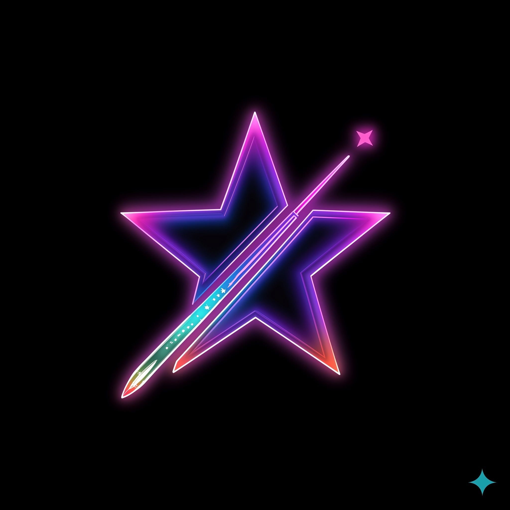
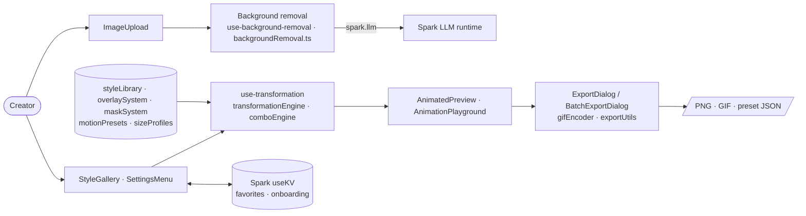

<p align="center">
  
</p>

<h1 align="center">STIX MAGIC · Sticker Motion Library</h1>

<p align="center"><b>Modular sticker-style studio that combines base styles, overlays, masks and motion presets into animated stickers</b></p>

<p align="center">
  <a href="LICENSE"></a>
  
  
  
  
</p>

A browser studio for STIX MAGIC stickers, built on the GitHub Spark template. You upload an image, pick from a style gallery built out of composable systems (base styles grouped into families, overlays, masks, motion presets and size profiles, validated by a combo engine), preview the animated result and export it, alone or in batches, as images, GIFs or preset JSON. Background removal and image analysis go through the Spark LLM runtime (`spark.llm`). Favourites and onboarding state persist in Spark KV. It is for the STIX MAGIC team designing the sticker-style catalogue. The system design is documented in [`ARCHITECTURE.md`](ARCHITECTURE.md).

## Architecture



## Stack

- React 19 + TypeScript on Vite (GitHub Spark template, `@github/spark` KV and LLM hooks)
- Tailwind CSS 4, shadcn/ui on Radix, Phosphor icons, Framer Motion
- Canvas-based rendering with an in-repo GIF encoder (`src/lib/gifEncoder.ts`)

## Project structure

```text
ARCHITECTURE.md  PRD*.md  STIX-MAGIC-BRANDING.md
src/
  App.tsx             studio shell
  components/         StyleGallery, ImageUpload, AnimatedPreview, Export dialogs, loaders…
  hooks/              use-transformation, use-background-removal, use-favorites, use-onboarding
  lib/                styleLibrary, comboEngine, overlay/mask/motion systems, gifEncoder, export utils
  assets/             brand images and video
```

## Local development

```bash
# Install dependencies
npm install

# Vite dev server
npm run dev

# Type-check and production build
npm run build

# ESLint
npm run lint
```

## Deploy

No deploy target is configured in this repo (no workflows or hosting config). `npm run build` outputs a static bundle to `dist/`. The LLM-backed background removal and the KV persistence need the GitHub Spark runtime.

## Status

Several product specs exist (`PRD.md`, `PRD-UPDATED.md`, `PRD-MASK-INTEGRATED.md`, `PRD-MOVEMENT-INTEGRATED.md`). Pick one as canonical and archive the rest before further implementation. Related: [stixmagic-bot](https://github.com/FriskyDevelopments/stixmagic-bot).

## License

See [LICENSE](LICENSE).
